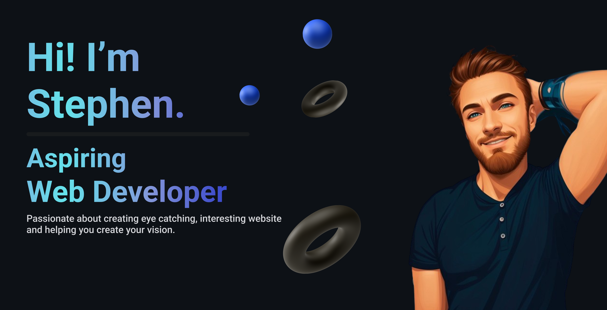

# Hi! I'm Stephen 👋💻

I'm currently a student working my way to a L5 Diploma in Web Application Development. I am passionate about creating eye catching interactive websites and that is where my learning path is taking me at the moment. I have been using the base languages for building any website HTML, CSS and Javascript, just starting my 3rd University Project using Python, Flask and PostgreSQL. Looking foward to expanding my knowledge and challenging myself to build new and creative projects to test myself. 

If you would like to keep up with my personal develpoment I keep a detailed record of everything here: [Personal Development Portfolio](https://github.com/StephenIles/Development-Portfolio). 

## Where you can find me on the Web 🌍

- [LinkedIn](https://www.linkedin.com/in/stephen-iles-7a0424262/)